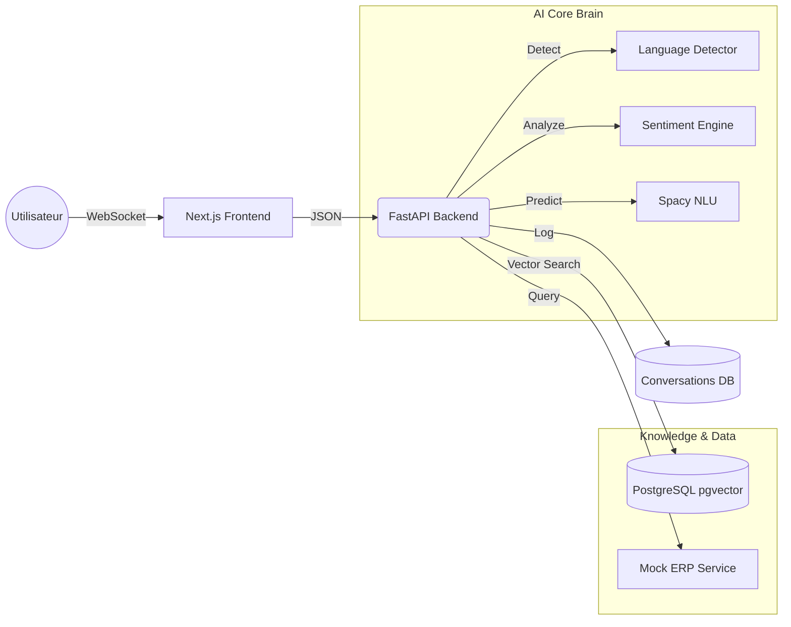

# 🤖 AI Support Agent - Multilingual & Intelligent

[](https://www.python.org/)
[](https://fastapi.tiangolo.com/)
[](https://nextjs.org/)
[](https://github.com/pgvector/pgvector)
[](https://www.docker.com/)
[](LICENSE)

> **Agent conversationnel intelligent** conçu pour automatiser le support client e-commerce sur le marché africain (Francophone & Arabophone). Combinaison d'architectures **NLU** (Natural Language Understanding) et **RAG** (Retrieval-Augmented Generation).

---

## 🎯 Vue d'ensemble

Ce projet résout le problème de la saturation des services clients en fournissant un assistant IA capable de traiter les demandes 24/7.
La plateforme utilise une architecture hybride pour garantir précision et contextualisation :

> 1.  **`Intent Recognition (NLU) :`** Pour les actions transactionnelles (Suivi de commande, identification client).
> 2.  **`RAG (Vector Search) :`** Pour répondre aux questions ouvertes via une Base de Connaissances (FAQ, Politiques).
> 3.  **`Sentiment Analysis :`** Détection de la frustration pour adapter le ton (Empathie).

### 🧠 Logique de l'Orchestrateur
Le système décide dynamiquement de la stratégie à adopter pour chaque message :
```python
IF (Langue == 'ARABE') 
    THEN Strategy = Hybrid_Search(RAG)
ELSE IF (Sentiment == 'NÉGATIF') 
    THEN Response = "Excuses Empathiques" + Action
ELSE IF (Intent == 'TRACK_ORDER' AND Entity == 'CMD-XXX') 
    THEN Action = Call_ERP_Mock(Order_ID)
ELSE 
    THEN Action = Vector_Search_FAQ(Query)
```

---

## Architecture

L'architecture est entièrement conteneurisée et repose sur une séparation claire Frontend/Backend.



---

## Stack Technique

| Composant | Technologie | Version | Description |
|-----------|-------------|---------|-------------|
| **Backend API** | **FastAPI** | 0.109 | Framework asynchrone haute performance |
| **NLU Engine** | **Spacy** | 3.7 | Reconnaissance d'intentions et d'entités (FR) |
| **Embeddings** | **Sentence-Transformers** | 2.7 | Vectorisation multilingue (MiniLM-L12) |
| **Vector DB** | **PostgreSQL** | 15 + pgvector | Stockage hybride (Relationnel + Vectoriel) |
| **Frontend** | **Next.js** | 13+ (App Router) | Interface Chat moderne & Responsive |
| **Styling** | **Tailwind CSS** | 3.0 | Design System & Animations (Framer Motion) |
| **DevOps** | **Docker** | Compose | Orchestration des services |
| **CI/CD** | **GitHub Actions** | - | Tests automatisés & Pipeline |

---

## 💻 Prérequis

Assurez-vous d'avoir installé :
*   **Docker Desktop** (avec WSL2 sur Windows).
*   **Make** (Optionnel, pour utiliser les raccourcis commandes).

```bash
# Vérification
docker-compose version
make --version
```

---

## Installation & Démarrage

### 1. Cloner et Lancer l'Infrastructure
```bash
git clone https://github.com/votre-user/ai-support-agent.git
cd ai-support-agent

# Démarrer tout le projet (Backend + DB + Frontend)
make start
# OU si vous n'avez pas Make : docker-compose up -d --build
```
*Patientez environ 2 minutes lors du premier lancement pour le téléchargement des modèles NLP (Spacy & Transformers).*

### 2. Initialiser les Données (Ingestion)

La base de données vectorielle est vide au démarrage. Il faut ingérer la FAQ (Français & Arabe).

```bash
make ingest
# OU : 
# docker-compose exec api python ingest_data.py
# docker-compose exec api python ingest_arabic.py
```

---

## ▶️ Utilisation & Scénarios

Accédez à l'interface de chat : **[http://localhost:3000](http://localhost:3000)**

### Scénario 1 : Suivi de Commande (Transactionnel)
*   **User:** "Où en est ma commande CMD-123 ?"
*   **Bot:** "Votre commande CMD-123 (iPhone 15) est actuellement : **En cours de livraison**..."

### Scénario 2 : Question FAQ (RAG)
*   **User:** "Quelle est la politique de retour ?"
*   **Bot:** "D'après mes informations : Les retours sont gratuits sous 30 jours..."

### Scénario 3 : Support Multilingue (Arabe)
*   **User:** "كيف يمكنني استرجاع المنتج؟"
*   **Bot:** "يمكنك إرجاع المنتج مجانًا خلال 30 يومًا."

### Scénario 4 : Gestion de la Colère (Sentiment Analysis)
*   **User:** "C'est nul, je n'ai rien reçu !"
*   **Bot:** "Je détecte une insatisfaction et je suis navré pour ce désagrément. [Réponse contextuelle...]"

---

## 📊 Administration & Monitoring

Un dashboard d'administration est disponible pour superviser les interactions et la satisfaction client.

Accédez à : **[http://localhost:3000/admin](http://localhost:3000/admin)**

*   **KPIs :** Volume de conversations, Taux de sentiment négatif.
*   **Logs :** Historique complet des conversations avec scores de sentiment et langues détectées.

---

## 🧪 Tests & Qualité

Le projet inclut une suite de tests unitaires et d'intégration (Pytest) exécutée via **GitHub Actions**.

Pour lancer les tests localement :
```bash
make test-backend
# OU : docker-compose exec api pytest -v
```

---

## 📁 Structure du Projet

```bash
ai-support-agent/
├── backend/                 # API FastAPI & Logique IA
│   ├── app/
│   │   ├── core/            # Moteurs (NLU, RAG, Sentiment, Orchestrator)
│   │   ├── schemas/         # Modèles Pydantic
│   │   └── main.py          # Entrypoint
│   ├── tests/               # Tests Pytest
│   ├── Dockerfile           # Configuration Docker Backend
│   └── requirements.txt     # Dépendances Python
├── frontend-next/           # Interface Next.js
│   ├── app/                 # Pages (Chat & Admin)
│   ├── components/          # Composants React (ChatInterface)
│   └── package.json         # Dépendances JS
├── docker-compose.yml       # Orchestration
├── Makefile                 # Commandes raccourcies
└── README.md                # Documentation
```

---

## 👨‍💻 Auteur

**SYLLA N'faly**  
*Ingénieur Data & IA*  
Projet réalisé dans le cadre du développement d'agents autonomes pour le service client.